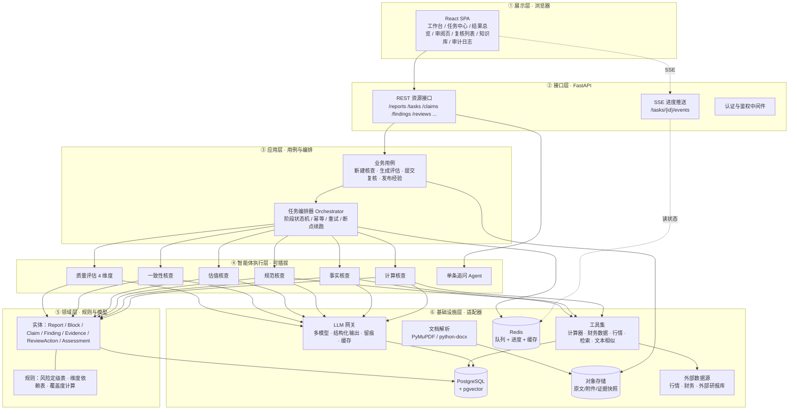
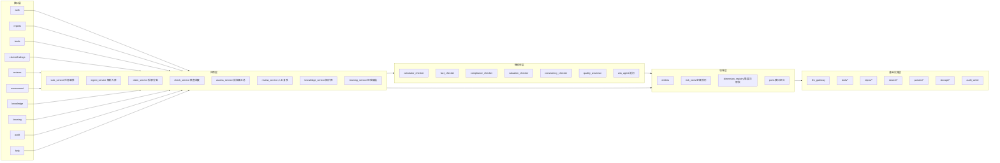
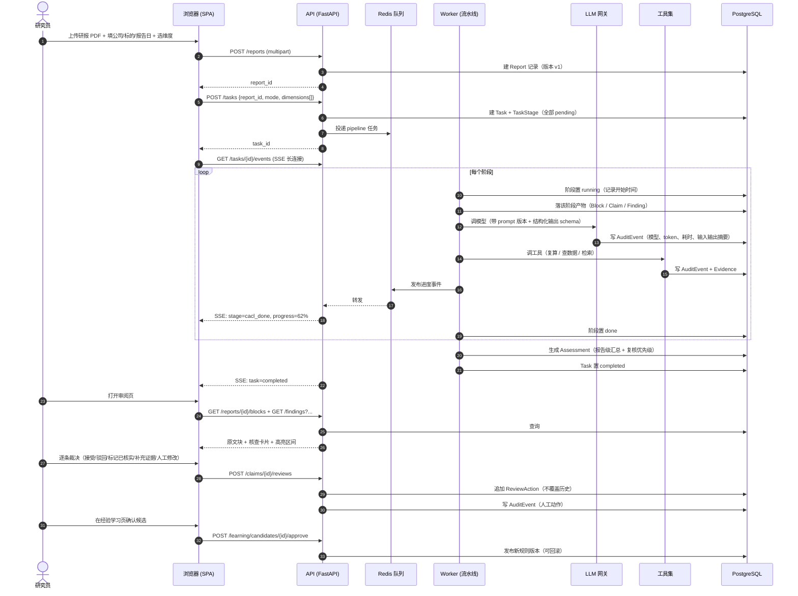
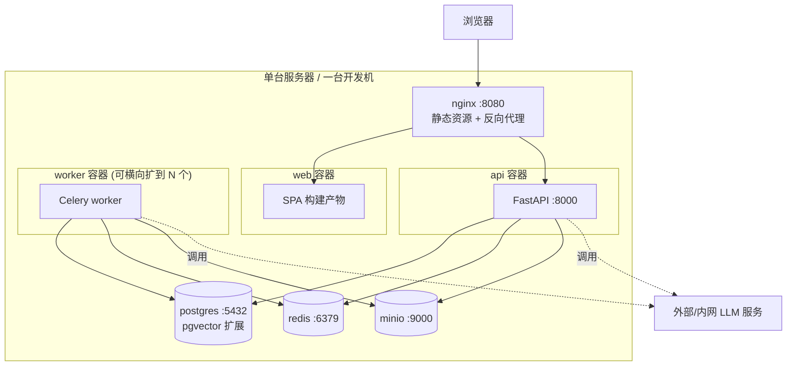

# 02 · 总体架构

> 上游约束：`01_设计方案调整.md` 的 D1–D12。
> 本文回答三个问题：**分成几层**、**用了什么技术（为什么）**、**一次核查怎么从头跑到尾**。

---

## 0. 架构目标与五条原则

| # | 原则 | 落地含义 |
| --- | --- | --- |
| P1 | **可追溯优先于聪明** | 宁可结论保守，也要说清"用了什么模型、什么工具、哪条证据得出的" |
| P2 | **确定性优先于灵活性** | 主流程是固定流水线，不用自由 Agent 循环；只有"单条追问"是开放对话 |
| P3 | **数字不靠模型算** | 任何数值结论必须由计算工具产出，附可复算的表达式 |
| P4 | **模块化单体，不是微服务** | 一个后端工程内严格分模块；只有"接口进程"和"任务进程"物理分离。理由：比赛规模、单机可部署、排障简单，但模块边界按将来可拆服务来划 |
| P5 | **失败要说出来，不能装作没发生** | 任何一步失败/缺数据，都在结果里显式可见（D12） |

---

## 1. 分层架构



**每层只允许向下依赖一层**，且**领域层不认识数据库和模型**（它只定义接口，具体实现在基础设施层）。这条是后面能换模型、换数据库、加维度的前提。

---

## 2. 技术选型

| 位置 | 选型 | 为什么是它 | 可替换 |
| --- | --- | --- | --- |
| 前端框架 | React 18 + TypeScript 5 | 组件生态最全；TS 让 05 文档里的接口契约能直接变成类型，前后端对不齐的问题在编译期暴露 | 换成 Vue 只影响 `04` 的目录结构，接口契约不变 |
| 前端构建 | Vite 5 | 启动快、配置少 | — |
| 前端 UI 库 | Ant Design 5 | 表格/筛选/表单/抽屉这些"中后台"控件开箱即用，比赛时间不该花在这些上面 | — |
| 前端状态 | TanStack Query v5（服务端状态）+ Zustand（界面状态） | 明确区分"服务器数据"和"本地界面状态"，避免把所有东西塞进一个全局 store | — |
| 前端图表 | ECharts | 风险分布、维度对比图够用 | — |
| 后端框架 | Python 3.11 + FastAPI | 与 LLM/文档解析生态同语言；Pydantic 天然承担"接口契约校验" | 后端换 Node 会失去解析与 AI 生态优势 |
| 数据校验 | Pydantic v2 | 同一套模型既校验 HTTP 入参，又校验模型输出的 JSON | — |
| ORM / 迁移 | SQLAlchemy 2.0 + Alembic | 迁移可控、可回滚 | — |
| 数据库 | PostgreSQL 16 | 事务与强一致（结论、证据、审计都要）；一套库搞定关系 + 全文 + 向量 | — |
| 向量检索 | pgvector | 不引入额外组件，证据分片和案例库量级（万级）完全够 | 量大后换 Qdrant |
| 缓存 / 队列 | Redis 7 | 队列 + 进度广播 + 结果缓存一个组件解决 | — |
| 任务队列 | Celery（worker 进程） | 成熟稳定；流水线阶段可重试、可限流、可观察 | 若团队以 asyncio 为主，可用 TaskIQ/arq，**应用层接口不变** |
| 对象存储 | MinIO（S3 兼容） | 原文、附件、证据快照不塞数据库；本地开发可直接落盘 | — |
| 文档解析 | PyMuPDF（PDF）+ python-docx（DOCX） | 都能给出稳定的字符位置，支撑 D2 的偏移定位 | 复杂版式可加 Docling |
| 大模型 | 经 **LLM 网关**接入（OpenAI 兼容协议 / DeepSeek / 通义 / 私有化） | 业务代码不认模型名，只认"能力档位"（快速档 / 深度档） | 换模型只改网关配置 |
| 可观测 | structlog（JSON 日志）+ 统一 trace_id | 一次任务的全链路日志能串起来 | 后续加 OpenTelemetry |
| 部署 | Docker Compose + Nginx | 单机三条命令起全栈，演示零风险 | 上云再换 K8s |

**关于"要不要微服务"**：不要。核查是**单任务内的强关联流程**（解析→拆解→核查→汇总都在同一批数据上），拆服务只会带来分布式事务和跨服务日志拼接的麻烦。用**模块化单体 + 任务进程**，把模块边界划清楚，就同时拿到了"好开发"和"将来能拆"。

---

## 3. 后端模块总览



要点：
- **接口层不含业务判断**：只做参数校验、鉴权、调用用例、组装响应。
- **应用层只编排、不算**：负责"下一步做什么"，具体判断交给智能体，具体规则查领域层。
- **智能体层是插件**：每个核查维度一个类，实现同一个接口，注册到 `dimension_registry`；加一个维度 = 加一个文件 + 一条注册记录。
- **基础设施层是适配器**：实现领域层定义的接口（端口），换实现不影响上层。

---

## 4. 端到端：一次核查怎么跑完



**两条关键约定**：
1. **HTTP 请求里只做"创建任务"，不做核查**。所有超过 1 秒的处理都在 worker 里（原则 P4 落地）。
2. **SSE 只推"状态变化"，不推业务数据**。数据仍通过 REST 拉取，刷新页面不会丢状态。

---

## 5. 前后端交互面（一共只有三种）

| 交互 | 用途 | 约定 |
| --- | --- | --- |
| REST（JSON） | 一切业务数据的读与写 | 路径按资源命名，动词由 HTTP 方法承担；错误统一结构（见 05） |
| SSE | 任务进度、阶段变化、复核状态变化 | 事件带 `task_id` + `stage` + `progress` + `message`；断线自动重连，重连后先拉一次状态 |
| 文件上传/下载 | 研报原文、附件、导出的评估报告 | multipart 上传；下载走对象存储预签名 URL |

不引入 WebSocket、GraphQL、gRPC。理由：当前交互是"请求-响应 + 单向进度"，三种通道已经覆盖全部需求，多一种协议就多一份排障成本。

---

## 6. 部署拓扑



**启动三条命令**：

```bash
cp .env.example .env          # 填模型 key、数据源 key
docker compose up -d db redis minio   # 起依赖
docker compose up -d api worker web   # 起应用
```

容器清单：`web` `api` `worker` `postgres` `redis` `minio`（演示版可把 `web` 合并进 `nginx`，把 `minio` 换成挂载卷）。

**扩缩容**：`worker` 是唯一需要横向扩展的（核查耗时都在这里）；`api` 无状态，多开即可；数据库与 Redis 单机足够撑比赛与内部试用规模。

---

## 7. 横切能力（每一层都要用，所以单独设计）

| 能力 | 设计 | 关键约定 |
| --- | --- | --- |
| 身份与权限 | JWT（access + refresh）+ 角色（研究员 / 管理员）+ 资源可见范围 | 请求上下文里带 `user_id / tenant_id / role`，仓储层自动过滤 |
| 审计 | 网关钩子 + 工具装饰器 + 阶段机，三处都写 `AuditEvent` | 任何"产生结论"的动作必须有对应审计记录，否则视为缺陷 |
| 配置 | `pydantic-settings` + `.env`；**规则与提示词不放环境变量，放数据库并版本化** | 提示词版本随 Finding 一起存档，用于回答"当时用的哪版" |
| 错误处理 | 业务异常分四类：参数错 / 权限错 / 数据不可用 / 系统错 | 前三类返回明确错误码给用户，第四类重试后标"阶段失败" |
| 幂等 | 阶段以 `(task_id, stage_code, attempt)` 为唯一键；写产物用 upsert | 重跑同一阶段不产生重复 Finding |
| 限流 | 按 `user_id` 限制并发任务数；按模型档位限制 QPS | 防止一人提交 20 份研报把模型配额打满 |
| 可观测 | 全链路 `trace_id`（HTTP → 阶段 → 模型调用 → 工具调用） | 排障时用一个 trace_id 能捞出全链路 |
| 缓存 | 相同 `(文档哈希 + 提示词版本 + 模型)` 的调用结果可复用 | 演示时预热一次，重跑秒出 |

---

## 8. 架构约束清单（写代码时不得违反）

这 8 条是评审时能直接对照代码检查的：

1. 前端不得直连数据库、不得持有模型 key，一切经 API。
2. 领域层不得 import 基础设施层（用 `ports.py` 里的接口做依赖倒置）。
3. 所有模型调用必须走 `llm_gateway`，**禁止**在业务代码里直接 `import openai`。
4. 所有数值计算必须走 `tools/calculator`，禁止模型口算后直接落库。
5. 每个流水线阶段必须写 `TaskStage` 记录，并且必须幂等。
6. 每条 `Finding` 必须带证据引用或显式标注"无依据"；高风险 Finding 必须有至少一条可点开的证据。
7. 任何超过 1 秒的处理不得放在 HTTP 请求线程里。
8. 每张业务表必须有 `tenant_id`、`created_at`、`updated_at`。

---

## 9. 与前文的对应关系

| 本文内容 | 展开在哪 |
| --- | --- |
| 分层与模块 | `03_后端架构.md` 与 `04_前端架构.md` |
| 阶段机、智能体接口 | `03_后端架构.md` |
| 审阅页、SSE、状态管理 | `04_前端架构.md` |
| 接口清单、字段、枚举、错误码 | `05_数据模型与接口契约.md` |
| 目录结构、测试、排期 | `06_工程规范与开发计划.md` |
