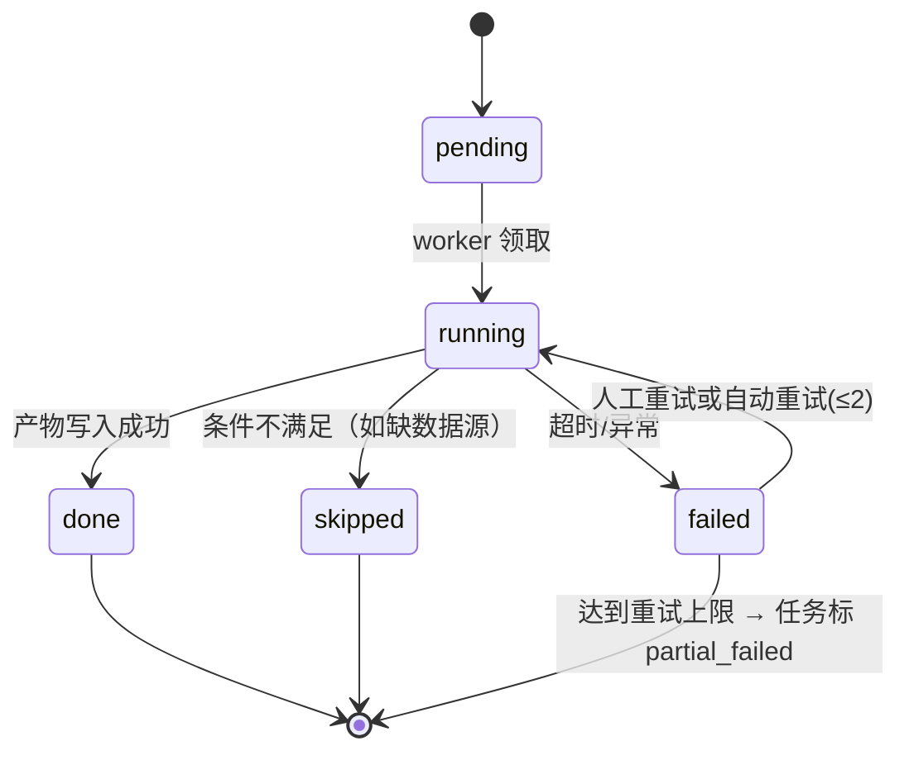

# 03 · 后端架构

> 上游：`02_总体架构.md` 的分层与模块。本文把后端拆到"能直接照着建工程"的粒度。
> 技术栈：Python 3.11 + FastAPI + Pydantic v2 + SQLAlchemy 2.0 + Celery + PostgreSQL(pgvector) + Redis。

---

## 0. 各层职责边界（写代码前先记这张表）

| 层 | 允许做 | 禁止做 | 典型文件 |
| --- | --- | --- | --- |
| `api/` 接口层 | 收参数、校验、鉴权、调用例、组响应、抛业务异常 | 写 SQL、写业务分支、调模型 | `api/routers/*.py` |
| `application/` 应用层 | 编排用例、管理事务边界、发队列消息、写审计 | 直接拼提示词、直接算数 | `application/*_service.py` |
| `agents/` 智能体层 | 取上下文、调工具、调模型、产出结论草案 | 直接写库、直接改状态 | `agents/*_checker.py` |
| `domain/` 领域层 | 定义实体、枚举、规则、接口（端口）、纯计算 | import 基础设施、连数据库 | `domain/**` |
| `infra/` 基础设施层 | 实现端口：仓储、模型网关、工具、解析、存储、检索 | 写业务规则 | `infra/**` |
| `workers/` 任务层 | 消费队列、驱动阶段机、重试、发进度 | 承载 HTTP 逻辑 | `workers/tasks.py` |

一条硬规则：**依赖只能从下往上 import**。`infra` 可以 import `domain`，`domain` 永远不 import `infra`。

---

## 1. 目录结构

```
backend/
├── app/
│   ├── main.py                     # FastAPI 实例、路由挂载、异常处理器
│   ├── config.py                   # pydantic-settings：读 .env
│   ├── deps.py                     # 依赖注入：db session、当前用户、服务实例
│   │
│   ├── api/
│   │   ├── routers/
│   │   │   ├── auth.py             # 登录/注册/刷新
│   │   │   ├── reports.py          # 研报上传、版本、原文
│   │   │   ├── tasks.py            # 建任务、查状态、SSE 进度、终止/重试
│   │   │   ├── claims.py           # Claim 列表、Finding 详情
│   │   │   ├── reviews.py          # 人工复核动作、修改历史
│   │   │   ├── assessment.py       # 报告级评估结果、导出
│   │   │   ├── knowledge.py        # 知识库文档与分片
│   │   │   ├── learning.py         # 经验案例、候选、审核发布
│   │   │   ├── audit.py            # 审计日志查询
│   │   │   └── help.py             # 帮助文档
│   │   └── errors.py               # 统一异常 → HTTP 响应（错误码见 05）
│   │
│   ├── application/                # 用例层（一个文件一个用例组）
│   │   ├── task_service.py         # 创建任务、校验维度依赖、投队列
│   │   ├── ingest_service.py       # 解析、分块、入库、生成 Block
│   │   ├── claim_service.py        # 拆解 Claim、分类、去重
│   │   ├── check_service.py        # 调度各 Checker、并发、汇总 Finding
│   │   ├── assess_service.py       # 报告级指标、优先级建议
│   │   ├── review_service.py       # 复核动作、三态结论计算
│   │   ├── knowledge_service.py    # 文档入库、切片、向量化、启停
│   │   └── learning_service.py     # 案例聚合、候选生成、审核发布
│   │
│   ├── agents/
│   │   ├── base.py                 # Checker 基类 + CheckContext + FindingDraft
│   │   ├── registry.py             # 维度注册表（读 domain 定义，实例化 Checker）
│   │   ├── calculator_checker.py   # 计算核查（P0）
│   │   ├── fact_checker.py         # 事实核查（P0）
│   │   ├── compliance_checker.py   # 规范核查（P0）
│   │   ├── valuation_checker.py    # 估值核查（P1）
│   │   ├── consistency_checker.py  # 前后一致性（P1）
│   │   ├── quality_assessor.py     # 质量评估 4 维度（P1）
│   │   ├── ask_agent.py            # 单条追问（P0，受限对话）
│   │   └── prompts/
│   │       ├── registry.py         # 提示词加载 + 版本解析
│   │       ├── extract_numbers.v3.md
│   │       ├── classify_claim.v2.md
│   │       └── ...
│   │
│   ├── domain/
│   │   ├── entities.py             # Report / Block / Claim / Finding / Evidence ...
│   │   ├── enums.py                # 类型、风险等级、状态（见 05 字典）
│   │   ├── dimensions.py           # 维度定义 + required_inputs + 工具与提示词绑定
│   │   ├── risk_rules.py           # 风险定级规则（纯函数，可版本化）
│   │   ├── coverage.py             # 覆盖率、通过率等指标计算（纯函数）
│   │   └── ports.py                # 仓储/网关/工具/检索 的抽象接口
│   │
│   ├── infra/
│   │   ├── db/                     # engine、session、base
│   │   ├── models/                 # SQLAlchemy 表模型（与 entities 分离）
│   │   ├── repos/                  # 仓储实现（实现 domain/ports）
│   │   ├── llm/                    # LLM 网关：providers、schema 校验、缓存、留痕
│   │   ├── tools/                  # calculator / finance / market / kb_search / textsim
│   │   ├── search/                 # 混合检索（FTS + pgvector + 融合排序）
│   │   ├── parsers/                # pdf_parser / docx_parser → Block 列表
│   │   ├── storage/                # 对象存储适配（MinIO / 本地）
│   │   ├── audit/                  # 审计写入器
│   │   └── progress/               # 进度发布（Redis pub/sub + 快照）
│   │
│   ├── workers/
│   │   ├── celery_app.py
│   │   ├── tasks.py                # 队列任务入口（薄壳，转调应用层）
│   │   └── pipeline.py             # 阶段机驱动：按顺序执行阶段、重试、断点续跑
│   │
│   └── common/                     # 日志、trace_id、时间、分页、文本工具
├── migrations/                     # Alembic
├── tests/
├── scripts/                        # 建库、导数据、评测集跑分
├── docker/                         # Dockerfile.*
├── docker-compose.yml
├── pyproject.toml
└── .env.example
```

**为什么 `domain/entities.py` 和 `infra/models/` 分开**：领域对象是给业务逻辑用的（带行为、不带数据库注解），表模型是给存储用的（带索引、外键）。分开之后，改表结构不会牵动业务逻辑，写单元测试也不用起数据库。

---

## 2. 领域层核心：维度注册表与风险定级规则

### 2.1 维度定义（加维度只改这里）

```python
# domain/dimensions.py
from dataclasses import dataclass, field

@dataclass(frozen=True)
class DimensionDef:
    code: str                     # 唯一标识，如 "calc"
    name: str                     # 中文名："计算核查"
    group: str                    # "核查" 或 "质量评估"
    desc: str                     # 一句话说明，用于前端展示
    required_inputs: list[str]    # 依赖的资料类型：[] / ["financial_data"] / ["kb:norm"]
    tools: list[str]              # 该维度可用的工具白名单
    prompt_key: str               # 提示词标识（版本在库里）
    model_tier: str               # "fast" | "deep"
    default_risk: str             # 默认风险等级（有风险时）
    enabled_in_modes: list[str]   # ["quick", "deep"]
    order: int = 0

DIMENSIONS: list[DimensionDef] = [
    DimensionDef("calc", "计算核查", "核查", "把文中的数值关系重新算一遍",
                 [], ["calculator", "kb_finance"], "calc_check", "fast", "high",
                 ["quick", "deep"], 10),
    DimensionDef("fact", "事实核查", "核查", "核对事实性表述与数据来源",
                 ["financial_data"], ["market_data", "kb_search", "calculator"],
                 "fact_check", "deep", "high", ["quick", "deep"], 20),
    DimensionDef("norm", "规范核查", "核查", "对照内部规范与禁用表达",
                 ["kb:norm"], ["kb_search"], "norm_check", "fast", "medium",
                 ["quick", "deep"], 30),
    DimensionDef("valuation", "估值核查", "核查", "检查估值假设与计算过程",
                 ["kb:valuation", "financial_data"], ["calculator", "kb_search"],
                 "valuation_check", "deep", "medium", ["deep"], 40),
    DimensionDef("consistency", "前后一致性", "核查", "同一份报告内前后是否矛盾",
                 [], ["calculator", "textsim"], "consistency_check", "fast", "medium",
                 ["quick", "deep"], 50),
    DimensionDef("quality_logic", "内容逻辑与结构", "质量评估", "材料是否支撑观点、结构是否完整",
                 [], ["textsim"], "quality_logic", "deep", "low", ["deep"], 60),
    DimensionDef("quality_data", "数据质量", "质量评估", "数据是否充足、来源是否权威",
                 ["financial_data"], ["kb_search", "calculator"], "quality_data",
                 "deep", "low", ["deep"], 70),
    DimensionDef("quality_risk", "风险提示", "质量评估", "风险揭示是否充分",
                 [], ["kb_search"], "quality_risk", "deep", "medium", ["deep"], 80),
    DimensionDef("quality_cross", "观点交叉验证", "质量评估", "与外部机构观点的差异是否合理",
                 ["external_reports"], ["kb_search", "textsim"], "quality_cross",
                 "deep", "low", ["deep"], 90),
]
```

前端"核查设置"页读的就是 `GET /dimensions`（字段原样返回）。**加一个维度 = 在这里加一条 + 写一个 Checker 类 + 加一个提示词文件**，前端零改动。

**`required_inputs` 是 D12 的入口**：任务创建时逐一检查，缺哪个就在任务上记 `uncovered_dimensions`，并在评估报告里显示"因缺少 X 未覆盖"。

### 2.2 风险定级规则（必须显式、可版本化）

风险等级不写在提示词里靠模型"感觉"，而是**规则表 + 判定结果**两层：

```python
# domain/risk_rules.py
RISK_ORDER = {"high": 3, "medium": 2, "low": 1, "pass": 0, "uncovered": -1}

# 规则：命中条件的风险下限（取所有命中的最大值）
RULES = [
    # code, 条件说明, 最低风险
    ("R-CALC-01", "复算结果与原文数字不一致（相对误差 > 1%）", "high"),
    ("R-CALC-02", "单位/口径不一致导致数量级错误",            "high"),
    ("R-CALC-03", "四舍五入导致的小差异（< 相对 1%）",        "low"),
    ("R-FACT-01", "与权威数据源冲突",                         "high"),
    ("R-FACT-02", "数据源无法核实且文中未标注来源",           "medium"),
    ("R-FACT-03", "结论句中的事实表述无任何标注",             "low"),
    ("R-NORM-01", "命中内部禁用表达（如收益承诺类表述）",     "high"),
    ("R-NORM-02", "命中内部规范要求但未满足（如未披露假设）", "medium"),
    ("R-CONS-01", "同一指标在不同章节数值矛盾",               "high"),
    ("R-RISK-01", "缺少风险提示章节或风险表述空泛",           "medium"),
]
```

模型只负责**判定条件是否命中 + 给出理由**，风险等级由规则表算出。这样：
- 同一类问题永远得到同一个等级（解决"定级因人而异"的风险）；
- 等级口径可以改，改完历史结论不变（因为 `risk_rule_version` 落在 Finding 里）。

---

## 3. 流水线设计（后端的心脏）

### 3.1 阶段清单

| # | stage_code | 名称 | 输入 | 输出 | 并行度 | 可跳过 | 失败策略 | 超时 |
| --- | --- | --- | --- | --- | --- | --- | --- | --- |
| 1 | `parse` | 文档解析 | 原始文件 | Block 列表（带偏移） | 串行 | 否 | 重试 2 次 | 60s |
| 2 | `structure` | 章节结构识别 | Block | 章节树 + 表格/图表标注 | 串行 | 是 | 降级：不识别结构 | 30s |
| 3 | `claim_split` | 语句拆解 | Block | Claim（含偏移、类型待定） | 按 Block 分块并行 | 否 | 重试 2 次 | 300s |
| 4 | `claim_classify` | Claim 分类 | Claim | 类型 + 置信度 | 批量并行 | 否 | 重试 2 次 | 180s |
| 5 | `evidence_build` | 证据预建 | Claim + 知识库 | 候选证据（检索结果） | 按 Claim 并行 | 是 | 缺库则标未覆盖 | 300s |
| 6 | `check` | 维度核查 | Claim + 维度配置 | Finding | **按维度 × Claim 并行** | 否 | 单条失败不影响整体 | 600s |
| 7 | `cross_validate` | 观点交叉 | Claim + 外部库 | Finding（交叉验证类） | 按 Claim 并行 | 是 | 无外部库 → 未覆盖 | 300s |
| 8 | `aggregate` | 报告级汇总 | 全部 Finding | Assessment（指标 + 摘要 + 优先级） | 串行 | 否 | 重试 2 次 | 120s |
| 9 | `snapshot` | 结果快照 | Assessment | 可导出的评估报告 + 版本号 | 串行 | 否 | 重试 1 次 | 60s |

**快速核查 vs 深度评估**只是**配置差异**，不是两套代码：

| 维度 | 快速核查（quick） | 深度评估（deep） |
| --- | --- | --- |
| 启用维度 | `enabled_in_modes` 含 quick 的（计算/事实/规范/一致性） | 全部（含估值与 4 个质量维度） |
| 执行阶段 | 1,3,4,6,8,9 | 1–9 全跑 |
| 模型档位 | 一律 fast 档 | 按维度各自 `model_tier` |
| Claim 处理 | 只查高风险类型 + 摘要句 | 全量 Claim |
| 目标耗时 | ≤ 3 分钟 | ≤ 8 分钟 |

### 3.2 阶段状态机



规则：
- **`skipped` 必须带原因**（`skip_reason`），前端直接显示"因缺少外部研报库，观点交叉验证未执行"。
- 一个阶段失败不必然导致整任务失败：`check` 阶段里单条 Claim 失败只影响该条（记 `Finding.status=error`），最终任务状态为 `partial_failed` 并提示"3 条未能核查"。

### 3.3 幂等与断点续跑

- 阶段唯一键：`(task_id, stage_code, attempt)`；同一阶段重复执行时，产物按业务唯一键 upsert：
  - Block：`(report_version_id, block_index)`
  - Claim：`(report_version_id, start_offset, end_offset, claim_type)`
  - Finding：`(claim_id, dimension_code, check_batch_id)`
- 断点续跑：`pipeline.py` 启动时先读所有 TaskStage，跳过 `done/skipped` 的阶段，只跑未完成的。**任务中断后重启，不会重复扣模型费用**。
- 手动"重新核查"= 新建一个 `check_batch`（新批次号），旧批次 Finding 保留 → 满足 D11 和"复核后可再核查，保留历史对比"。

### 3.4 并行与限流

- Claim 级任务分片：一批 20 条 Claim 一次模型调用（省 token、省时间），失败只重试该批。
- 并发控制：`check` 阶段用 Celery 的并发子任务，上限由配置 `CHECK_CONCURRENCY`（默认 4）。
- 模型侧限流：网关内按 `model_tier` 做令牌桶；超限自动排队而不是报错。

---

## 4. 核查智能体（Checker）设计

### 4.1 统一接口

```python
# agents/base.py
from abc import ABC, abstractmethod
from dataclasses import dataclass, field

@dataclass
class CheckContext:
    """交给 Checker 的一切上下文，Checker 不许自己去查库"""
    task_id: str
    report: ReportRef                  # 公司/标的/报告日
    claims: list[ClaimRef]             # 本批要查的 Claim（含原文与偏移）
    report_blocks: list[BlockRef]      # 全文块（用于文内互证，按需截取）
    knowledge_snippets: list[Snip]     # 已检索好的知识库片段
    data_snapshots: dict               # 已取好的外部数据（键为指标名）
    rules: list[RuleHit]               # 已命中的显式规则（如禁用表达）

@dataclass
class FindingDraft:
    claim_id: str
    dimension_code: str
    status: str                        # pass | risk | uncovered | error
    risk_level: str | None             # high | medium | low | pass | None
    rule_hits: list[str]               # 命中的规则编号
    reason: str                        # 判断理由（一段话，面向人）
    suggestion: str | None             # 修改建议（可直接替换的句子）
    calc_trace: dict | None            # 计算过程：表达式 + 步进 + 结果
    evidences: list[EvidenceDraft]     # 证据（必须带来源）
    confidence: float
    model_ref: str                     # 由哪个模型产出
    prompt_version: str

class BaseChecker(ABC):
    dimension: DimensionDef

    @abstractmethod
    def prepare(self, ctx: CheckContext) -> CheckContext:
        """补齐该维度需要的额外上下文（调工具/检索）；缺资料时抛 Uncovered"""

    @abstractmethod
    def judge(self, ctx: CheckContext) -> list[FindingDraft]:
        """核心判断：调模型 + 规则定级"""

    def run(self, ctx: CheckContext) -> list[FindingDraft]:
        ctx2 = self.prepare(ctx)          # 1. 备料
        drafts = self.judge(ctx2)         # 2. 判断
        return [self.finalize(d) for d in drafts]   # 3. 定级 + 校验
```

三条规矩（评审时可直接对照代码）：
1. **Checker 不写库**。它只返回草案，落库由 `check_service` 统一做（这样审计和幂等只有一处实现）。
2. **Checker 不自己取数**。取数在 `prepare` 里通过工具完成，好处是"取数过程"本身也被审计。
3. **`finalize` 里做风险定级**：用 `domain/risk_rules.py` 算，不看模型的自我评级。

### 4.2 三个 P0 维度的具体做法

#### 计算核查（`calculator_checker`）

```
① 从 Claim 里抽数值与关系 → 结构化 {指标, 值, 单位, 期间, 出处}
② 归一化：单位换算（万元/亿元）、期间对齐、百分比与小数统一
③ 生成可复算式（如 "净利润同比 = (12.3 - 10.1)/10.1"）
④ 调 tools.calculator 求值（Decimal 精确计算，禁止 float 直接比）
⑤ 与原文数字比对：相对误差 > 1% → 命中 R-CALC-01
⑥ 输出 FindingDraft，calc_trace 带完整步进（前端"核算过程"直接渲染）
```

关键点：**模型只负责把自然语言变成算式，算式由工具算**。这一步让"计算过程"能原样展示，也让数字结论可复算。

#### 事实核查（`fact_checker`）

```
① 判定 Claim 是否事实性（含实体 + 可验证数据/事件）
② 生成检索式（实体 + 指标 + 期间 + 关键词）
③ 三路取证：外部数据源（行情/财务）→ 文内他处互证 → 知识库/案例库
④ 证据充分性判断：有权威源且一致 → pass；冲突 → 命中 R-FACT-01；
   无源且文中未标注 → 命中 R-FACT-02
⑤ 无外部数据源时：只做文内互证，并在 Finding 里标 uncovered_reason
```

**禁止**：用模型自己的记忆当作事实依据。证据必须来自工具返回的、可点开的来源。

#### 规范核查（`compliance_checker`）

```
① 规则先跑：禁用表达表（正则/关键词）→ 命中即 R-NORM-01（不依赖模型）
② 规范条目向量检索：把"该章节应满足的规范条目"召回
③ 模型判定：逐条判断是否满足，必须引用规范条目编号
④ 未满足 → R-NORM-02；无法判断 → 标待人工确认（不算通过）
```

规范核查尽量用**规则先筛、模型后判**，因为禁用表达类问题是确定性判断，不该交给模型。

### 4.3 提示词管理

- 提示词是**文件 + 版本号**：`prompts/extract_numbers.v3.md`，运行时由 `prompts/registry.py` 加载，版本号写进 `Finding.prompt_version`。
- 提示词结构统一四段：**角色与目标 / 输入数据 / 输出 JSON Schema / 硬约束**（如"只输出 JSON""不得编造来源"）。
- 模板变量只允许从 `CheckContext` 注入，不允许运行时代码拼接字符串（便于审计与回归测试）。
- **提示词变更必须跑评测集**（`scripts/eval_prompt.py`），对比新旧版本在 golden set 上的准确率，防止改一处坏一片。

---

## 5. LLM 网关

```python
# infra/llm/gateway.py
class LLMGateway:
    def call_structured(self, *, prompt_key: str, variables: dict,
                        schema: type[BaseModel], tier: str = "fast",
                        audit: AuditCtx) -> BaseModel:
        """
        1. 解析提示词与版本
        2. 查缓存：key = hash(prompt_version + variables + model + schema_version)
        3. 选择模型：tier -> 具体模型（配置驱动，业务不感知）
        4. 调用（超时 + 重试 + 令牌桶限流）
        5. 输出校验：json.loads -> schema 校验
           校验失败 -> 把错误回灌模型重试一次 -> 再失败 -> 返回 DegradedResult
        6. 写 AuditEvent：模型名/版本、prompt 版本、token、耗时、输入摘要、输出摘要
        7. 返回结构化对象
        """
```

| 关注点 | 做法 |
| --- | --- |
| 结构化输出 | 强制 JSON Schema + Pydantic 二次校验；一次纠错重试；再失败降级（不伪造结果，标 `status=error`） |
| 多模型 | 配置里把 `fast/deep` 映射到具体模型；支持按维度覆盖 |
| 缓存 | 相同提示词版本 + 相同输入 → 直接复用；**注意**：只在 version 与 model 完全相同时复用 |
| 留痕 | 所有调用无例外写审计；输入输出存摘要 + 哈希（敏感内容不落全量） |
| 成本 | 记录每次 token 与估算费用，按任务汇总，可在审计页看到 |
| 失败语义 | 网关只抛三类异常：`SchemaInvalid`、`ProviderError`、`RateLimited`，由上层决定重试或降级 |

---

## 6. 工具集（Tool）

工具是"确定性能力"的统一入口。**每个工具都被装饰器包一层，自动写审计、计时、超时与降级**。

| 工具 | 用途 | 输入 | 输出 | 外部依赖 |
| --- | --- | --- | --- | --- |
| `calculator` | 精确求值与单位换算 | 表达式 + 变量表 | 值 + 步进明细 | 无（本地 Decimal） |
| `finance_kb` | 查财务指标定义与机构标准 | 指标名 | 定义 + 标准口径 | 知识库 |
| `market_data` | 取行情/估值数据（按报告日） | 标的 + 指标 + 日期 | 数值 + 数据源 + 取数时间 | 外部数据接口 |
| `financial_data` | 取财报科目数据 | 标的 + 科目 + 期间 | 数值 + 来源报表 | 外部数据接口 |
| `kb_search` | 知识库混合检索 | 查询 + 过滤（机构/类型/生效期） | 分片列表（带 chunk_id） | pgvector + FTS |
| `external_report_search` | 外部研报检索（观点交叉） | 标的 + 主题 | 研报片段 + 机构 + 日期 | 外部研报库 |
| `textsim` | 文内/跨文相似与矛盾检测 | 两段文本 | 相似度 + 矛盾点 | 本地模型或接口 |
| `parser_tools` | 表格抽取、单位识别 | 原始块 | 结构化表格 | 解析器 |

工具设计三条规矩：
1. **有副作用的工具不许出现在 Checker 里**（如"发邮件""改数据"），Checker 只准用只读工具。
2. **工具必须能离线降级**：外部接口不可用时返回 `Unavailable`，由 Checker 转成"未覆盖"，**不许返回空值当通过**。
3. **取数必须锁定报告日**：`as_of=report_date`，避免用未来数据检查历史判断。

---

## 7. 数据访问、事务与一致性

| 问题 | 处理 |
| --- | --- |
| 事务边界 | 在应用层划：一个用例一个事务；模型调用与工具调用**不在事务内**（避免长事务） |
| 长流程一致性 | 每个阶段先落产物再更新阶段状态；阶段产物落库失败 → 阶段回 `failed`，产物按唯一键 upsert 不会重复 |
| 并发写同一任务 | 任务行加乐观锁（`version` 字段）；两个 worker 抢同一阶段时后者直接退出 |
| 人工复核与 AI 结论 | `ReviewAction` 追加写，永不更新历史；"生效结论"是查询时算出来的，不落冗余字段（避免不一致） |
| 版本 | `report_version`（文件版本）、`check_batch`（核查批次）、`rule_version`（规则/提示词版本）三者独立外键 |
| 删除 | 业务数据一律软删（`deleted_at`），审计与结论不允许物理删除 |

---

## 8. 审计与可观测

### 8.1 审计记录结构（核心表，见 05）

| 字段 | 说明 |
| --- | --- |
| `trace_id` | 全链路 ID，HTTP → 阶段 → 模型/工具 |
| `task_id` / `stage_code` | 归属 |
| `event_type` | `stage_start` `stage_end` `llm_call` `tool_call` `review_action` `rule_publish` |
| `actor` | `system` 或 `user:{id}`（人工动作必须记人） |
| `model` / `prompt_version` / `rule_version` | 用了什么 |
| `tool_name` / `input_digest` / `output_digest` | 用了什么工具、输入输出摘要（含哈希） |
| `duration_ms` / `token_in` / `token_out` / `cost` | 花了多少 |
| `status` / `error` | 结果 |

**审计页要能回答的三个问题**（对应需求表"智能体执行的详细记录"）：
1. 这次核查调了哪些模型和工具？（按 task_id 过滤 `event_type in (llm_call, tool_call)`）
2. 这条结论凭什么？（Finding → 关联的 evidence → 关联的 tool_call/llm_call）
3. 谁改了什么？（按 claim_id 过滤 `review_action`）

### 8.2 trace_id 传播

HTTP 入口生成 → 写进队列消息 → worker 取出后放进 contextvar → 网关与工具自动带上。**任何日志行都必须带 trace_id**，这是排障的底线。

---

## 9. 错误处理与降级矩阵

| 失败点 | 处理 | 用户看到 |
| --- | --- | --- |
| 文件解析失败（加密/扫描件） | 阶段 failed，不重试 | "文档解析失败：疑似扫描件，请上传可复制文本的版本" |
| 外部数据源超时 | 重试 2 次 → 该维度标 uncovered | "事实核查未覆盖：数据源不可用" |
| 知识库为空 | 该维度标 uncovered | "规范核查未覆盖：未配置规范知识库" |
| 模型输出不符合 Schema | 纠错重试 1 次 → 该条标 error | "第 37 条核查失败，可重试" |
| 模型限流 | 排队等待，不报错 | 进度条上显示"排队中" |
| 单条 Claim 核查异常 | 只影响该条 | "1 条未能核查"（任务状态 partial_failed） |
| 汇总阶段失败 | 重试 2 次 → 任务 failed 但 Finding 已保留 | "结果已生成但汇总失败，可单独重试汇总" |
| 全量失败 | 任务 failed，保留所有中间产物 | 明确失败原因 + 重试按钮 |

**统一原则：中间产物永不丢弃。** 解析结果、Claim、已完成的 Finding 全部落库，重试只补没做完的部分。

---

## 10. 性能与成本

| 手段 | 效果 |
| --- | --- |
| Claim 批量处理（20 条/次调用） | 调用次数降一个量级，token 利用率提升 |
| 只把相关片段进上下文（检索选片段，不塞全文） | 单次上下文从几万 token 降到几千 |
| 两档模式（quick/deep） | 快速核查成本约深度评估的 1/4 |
| 按维度分模型档位（fast/deep） | 简单判断不用贵模型 |
| 结果缓存（prompt_version + 输入哈希） | 重跑与演示几乎零成本 |
| 阶段级断点续跑 | 失败重试不重复扣费 |
| 并发上限可配 | 防止把外部接口或模型配额打满 |

---

## 11. 后端"完成定义"（DoD，每写完一个模块照这张表自检）

1. 单元测试覆盖领域层纯函数（定级规则、覆盖率计算、单位换算）≥ 80%。
2. 每个能被外部触发的失败路径都有明确错误码与用户可读文案。
3. 新增模型调用/工具调用自动出现在审计日志里（无需手写埋点）。
4. 阶段可单独重跑，且重跑不产生重复数据。
5. 没有数据库连接的单元测试能跑通（说明领域层没被污染）。
6. 接口与 `05_数据模型与接口契约.md` 一致（用契约测试自动化校验）。
