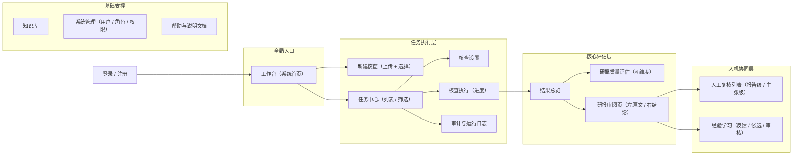

# 04 · 前端架构

> 上游：`02_总体架构.md` 的分层与前后端交互面；重点落地 D9（自研双栏审阅组件）与 D10（SSE 进度）。
> 技术栈：React 18 + TypeScript 5 + Vite 5 + Ant Design 5 + TanStack Query v5 + Zustand + ECharts。

---

## 0. 前端只有三个真正的难点

其余页面都是标准中后台，用现成组件拼。真正要花心思的是这三件：

| # | 难点 | 解法（本文 §5.5 / §9） |
| --- | --- | --- |
| 1 | **原文与核查结论的双向定位**：点句子出卡片、点卡片跳句子、高亮不能错位 | 偏移量驱动的分段渲染 + ref 索引双向联动；不用富文本编辑器 |
| 2 | **长任务进度的可信展示**：几分钟的任务，用户要知道"到哪一步了、卡在哪" | SSE 推送阶段事件 + 断线重连后先拉快照 + 失败阶段显示原因与重试 |
| 3 | **逐条裁决的复核效率**：几十上百条结论要快速处理完 | 键盘优先的复核流（j/k 上下、热键裁决）+ 乐观更新 + 风险过滤 |

设计取向声明：**这是给人干活用的工具，不是展示页**。信息密度可以高，动效要少，键盘要比鼠标快。

---

## 1. 页面地图（严格对应需求表 Sheet3 的结构）



**与需求表的两处收敛**（见 01 §1 Q2）：
- 工作台是唯一首页；"任务中心"是任务的完整筛选视图，不再重复做一套"我的任务"。
- 左侧导航固定六组：工作台 / 任务中心 / 结果与审阅 / 人工复核 / 知识与学习 / 系统支持。

---

## 2. 路由表

| 路径 | 页面 | 关键参数 | 权限 |
| --- | --- | --- | --- |
| `/login` | 登录 / 注册 | — | 公开 |
| `/` | 工作台 | — | 登录 |
| `/tasks/new` | 新建核查 | `?reportId=` | 研究员 |
| `/tasks` | 任务中心 | `?status=&owner=&company=&page=` | 登录 |
| `/tasks/:taskId/settings` | 核查设置 | taskId | 研究员 |
| `/tasks/:taskId/run` | 核查执行（进度） | taskId | 登录 |
| `/tasks/:taskId/audit` | 审计与运行日志 | taskId | 登录 |
| `/reports/:reportId/overview` | 结果总览 | reportId, `?batch=` | 登录 |
| `/reports/:reportId/quality` | 研报质量评估 | reportId, `?dim=` | 登录 |
| `/reports/:reportId/review` | **研报审阅页** | reportId, `?claim=&filter=` | 登录 |
| `/reviews` | 人工复核列表（报告级） | `?status=&risk=&company=` | 登录 |
| `/reviews/:reportId/queue` | 主张级复核队列 | reportId, `?risk=&status=` | 登录 |
| `/knowledge` | 知识库 | `?type=&q=` | 登录 |
| `/learning` | 经验学习 | `?state=` | 登录 |
| `/audit` | 全局审计 | `?taskId=&event=` | 登录 |
| `/admin/*` | 系统管理 | — | 管理员 |
| `/help/*` | 帮助与说明 | — | 登录 |

**规则：一切"能改变视图结果"的状态都进 URL**（筛选、分页、选中的 Claim、当前核查批次）。这样"把这条高风险的链接发给人"才成立，刷新也不丢。UI 临时状态（抽屉开合、折叠）才放 Zustand。

---

## 3. 目录结构（按"页面 → 能力 → 共享"分层）

```
frontend/src/
├── app/
│   ├── router.tsx              # 路由表（懒加载）
│   ├── providers.tsx           # QueryClient / Theme / Auth / ErrorBoundary
│   ├── layout/
│   │   ├── AppShell.tsx        # 左侧导航 + 顶栏 + 任务进度挂件
│   │   └── nav.config.ts       # 导航定义（与 §1 页面地图一一对应）
│   └── styles/
│
├── pages/                      # 只做编排：取数据 → 摆组件 → 传事件
│   ├── login/
│   ├── dashboard/              # 工作台
│   ├── task-new/               # 新建核查
│   ├── task-center/            # 任务中心
│   ├── task-settings/          # 核查设置
│   ├── task-run/               # 核查执行（进度）
│   ├── report-overview/        # 结果总览
│   ├── report-quality/         # 研报质量评估
│   ├── report-review/          # 研报审阅页（核心）
│   ├── review-list/            # 人工复核列表（两层共用）
│   ├── knowledge/
│   ├── learning/
│   ├── audit/
│   ├── admin/
│   └── help/
│
├── features/                   # 领域能力：组件 + hooks + 类型，按业务切
│   ├── report-uploader/
│   ├── dimension-picker/       # 维度勾选 + 依赖资料提示（读 required_inputs）
│   ├── task-progress/          # SSE 进度订阅 + 阶段列表
│   ├── finding-card/           # 单条核查结论卡片（类型/风险/证据/算式/建议）
│   ├── evidence-viewer/        # 证据查看（回原文 / 看知识库片段 / 看数据源）
│   ├── calc-trace/             # 计算过程步进展示
│   ├── review-actions/         # 4 个人工动作 + 复核历史
│   ├── ask-drawer/             # 单条追问抽屉（流式回答）
│   ├── risk-badge/             # 风险等级徽标（统一配色）
│   └── assessment-charts/      # 风险分布、维度对比、覆盖率
│
├── shared/
│   ├── ui/                     # 通用组件：表格、筛选栏、空态、加载骨架、确认框
│   ├── hooks/                  # useDebounce / useKeyboardList / useEventSource ...
│   ├── utils/                  # 格式化、时间、文本高亮切分
│   └── types/                  # 全局通用类型
│
├── api/
│   ├── client.ts               # fetch 封装：鉴权、错误归一、traceId
│   ├── endpoints/              # 按资源一个文件：reports.ts / tasks.ts / findings.ts ...
│   ├── sse.ts                  # SSE 客户端（重连 + 快照兜底）
│   └── generated/              # 由后端 OpenAPI 生成的类型（自动，不手改）
│
└── store/                      # Zustand：只放界面状态
    ├── uiStore.ts              # 侧栏、抽屉、审阅页视图偏好
    └── reviewStore.ts          # 当前选中的 Claim、过滤条件（与 URL 同步）
```

**分层纪律（一句话判断一个文件该放哪）**：
- 只被一个页面用到 → `pages/<page>/` 内部；
- 被两个以上页面用到、且带业务语义 → `features/`；
- 不带业务语义 → `shared/`；
- 页面文件里出现大段 JSX 计算或 `useEffect` 业务逻辑 → 说明该下沉到 `features/`。

---

## 4. 状态管理：三类状态，三个地方

这是前端最容易写乱的地方，先定规矩：

| 状态类型 | 放哪 | 例子 | 为什么 |
| --- | --- | --- | --- |
| **可分享 / 可回退的状态** | URL（`useSearchParams`） | 当前报告、选中的 Claim、筛选条件、页码、核查批次 | 分享链接、刷新不丢、浏览器后退符合直觉 |
| **服务端数据** | TanStack Query | 任务列表、Claim 与 Finding、审计日志、知识库 | 自带缓存、重试、失效、乐观更新、并发去重 |
| **纯界面状态** | Zustand | 抽屉开合、列表密度、是否显示"未覆盖"项、快捷键开关 | 不需要持久化、不需要分享 |

**明确禁止**：把服务端数据复制进 Zustand 再自己同步（必然会不一致）；用 `useEffect` 手动请求数据（用 Query）。

### Query Key 规范

```ts
// 统一使用数组 key，且按"资源 → 参数"排列，便于批量失效
['tasks', { status, page }]
['task', taskId]
['task', taskId, 'stages']
['report', reportId, 'blocks']
['report', reportId, 'claims', { filter }]
['claims', claimId, 'findings']
['claim', claimId, 'reviews']
['report', reportId, 'assessment', batchId]
['audit', { taskId, eventType }]
```

**失效规则**：提交复核动作后，只需失效 `['claim', claimId, 'reviews']`、`['report', reportId, 'claims']`、`['reviews', ...]`、`['report', reportId, 'assessment']` 四处，其余不动（避免整页闪）。

---

## 5. 核心页面要点

### 5.1 工作台（系统首页）

| 区块 | 内容 | 数据来源 |
| --- | --- | --- |
| 快速入口 | 新建核查 / 继续未完成任务 | — |
| 进行中任务 | 任务名、阶段进度条、已耗时、当前阶段 | `GET /tasks?status=running` |
| 待人工复核 | 报告列表 + 待复核条数 + 高风险条数 | `GET /reviews/summary` |
| 高风险提醒 | 近 7 天内高风险的报告与条数，可点进审阅页 | `GET /reviews/summary` |
| 最近使用 | 最近打开的报告 | 本地记录 + 报告详情 |

工作台**只做跳转**，不做任何裁决动作（裁决统一在审阅页/复核队列，避免两处逻辑）。

### 5.2 核查设置（`dimension-picker` + 依赖提示）

- 两档模式单选：**快速核查 / 深度评估**。
- 维度勾选：从 `GET /dimensions` 渲染，按 `group` 分组（核查 / 质量评估），每项显示一句话说明；只读展示 `enabled_in_modes` 不匹配则置灰并说明"该维度仅在深度评估中可用"。
- **依赖资料提示（Q4 的落地）**：勾选后前端计算 `required_inputs` 的并集，缺哪个就出现一行提示 + 上传按钮，例如：

```
已选维度需要：内部规范库（已配置 ✓）、外部研报库（缺失）
[上传外部研报库]  ⓘ 未配置时，观点交叉验证将标记为"未覆盖"
```

- **文案必须说清"未覆盖 ≠ 通过"**，这是全系统的信任基础。
- 高级选项（默认收起）：并发数、是否重跑已完成维度、是否复用缓存结果。

### 5.3 核查执行（进度页）

阶段列表（来自 `GET /task/{id}` 的 stages）：

```
✓ 文档解析          12s
✓ 语句拆解          38s   共拆出 412 条
● 语句分类          进行中  320/412
○ 维度核查          等待中  已选 3 个维度
○ 报告级汇总        等待中
```

- 每个阶段行可展开看日志摘要（调用了几次模型、几次工具、当前处理到哪条 Claim）。
- 顶部总进度条用**加权进度**（不是阶段数平均）：`parse 5% + split 20% + classify 25% + check 45% + aggregate 5%`，各阶段内部再按条数比例推进。权重放在后端配置里，前端只消费 `progress` 字段。
- 失败阶段：红色 + 失败原因 + `[重试该阶段]` 按钮。
- 允许 `[终止任务]`；终止后已完成阶段的产物保留（可续跑）。

### 5.4 结果总览

| 区块 | 内容 |
| --- | --- |
| 结论卡 | 总体风险等级 + 一句话摘要（后端生成，不前端拼） |
| 风险分布 | 高 / 中 / 低 / 通过 / **未覆盖** 五类计数，点击即筛选并跳审阅页 |
| 维度表现 | 每个维度：问题数、覆盖率（有证据支撑的比例）、未覆盖原因（若有） |
| 复核优先级建议 | 高优先级 Claim 列表（前 10 条，带类型与摘要），一键进入复核队列 |
| 关键问题摘要 | 3–5 条最严重问题的摘要（含原文定位链接） |
| 参考分（可选） | 若启用：显示分数并**固定附注**"由指标加权得出，用于排序，不代表研报质量结论" |

所有可点击的数字都跳到 `?filter=` 已设置好的审阅页/复核队列，**不做二次筛选页面**。

### 5.5 研报审阅页（系统最核心的页面，重点写）

#### 布局

```
┌─────────────────────────────┬──────────────────────────┬──────────┐
│ 左：原文（可滚动，逐句高亮）      │ 右：结论列表（与原文联动）    │ 侧：追问抽屉 │
│                             │ ┌──────────────────────┐ │（按需展开）│
│  [H2] 一、公司概览             │ │ 高风险 · 计算核查       │ │          │
│  ▌2026Q2 营收 12.3 亿元，同比  │ │ 原文：…营收 12.3 亿元…  │ │ 为什么被 │
│   ▌增长 25%（←点击选区）       │ │ 证据：财报 P12 (链接)   │ │ 判定为高 │
│                             │ │ 核算：(12.3-10.1)/10.1 │ │ 风险？   │
│  [H2] 二、盈利预测             │ │      =21.8% ≠ 25%     │ │          │
│                             │ │ 建议：改为 21.8%        │ │ [流式回答]│
│                             │ │ [接受][驳回][已核实]    │ │          │
│  左侧边缘：风险色带（全文风险分布） │ └──────────────────────┘ │          │
└─────────────────────────────┴──────────────────────────┴──────────┘
```

三栏宽度可拖拽；侧栏可折叠；窄屏（<1280px）时右栏改为抽屉。

#### 高亮渲染：用偏移量切分，不用富文本编辑器

数据前提（见 05）：每个 Block 是**纯文本 + 字符区间**，Claim 带 `start` / `end`。

```ts
// shared/utils/segment.ts —— 纯函数，必须有单元测试
type Segment = { text: string; claimIds: string[]; risk: RiskLevel | null };

export function buildSegments(blockText: string, claims: ClaimSpan[]): Segment[] {
  // 把 block 文本按所有 claim 区间切成互不重叠的片段
  // 重叠处理：按 (start 升序, end 降序) 排序，重叠时保留"最深"的一个作为主色，
  //          其余放进 claimIds 中，点击时弹出多结论选择（一句双问题很常见）
  // 无 claim 覆盖的部分：claimIds = []，正常渲染
}
```

```tsx
// pages/report-review/BlockView.tsx
export function BlockView({ block, claims, activeClaimId, onPick }: Props) {
  const segs = useMemo(() => buildSegments(block.text, claims), [block.text, claims]);
  return (
    <p className="block">
      {segs.map((s, i) => (
        <span
          key={i}
          data-claim-ids={s.claimIds.join(",")}
          className={cx("seg", s.risk && `risk-${s.risk}`,
                        s.claimIds.includes(activeClaimId!) && "active")}
          onClick={() => s.claimIds.length && onPick(s.claimIds)}
        >
          {s.text}
        </span>
      ))}
    </p>
  );
}
```

**为什么不用富文本编辑器**：编辑器会重排 DOM、包装额外的 span、改写文本，导致偏移量与真实 DOM 对不上——高亮错位是最致命的体验问题。自己按偏移量渲染，位置永远准确。

#### 双向联动（这是"能干活"的关键）

| 方向 | 触发 | 实现 |
| --- | --- | --- |
| 右 → 左 | 点击右侧卡片 | `blockRefs.get(claim.blockId)?.scrollIntoView({block:'center'})` + 给对应 span 加 `active` 类（闪烁一次） |
| 左 → 右 | 点击原文高亮句 | 更新 URL `?claim=xxx`，右侧列表滚动到该卡片并展开；若一句多结论，先弹出一个小选择条 |
| 滚动时高亮 | 用户主动滚动原文 | `IntersectionObserver` 监听每个 Block，把"当前可视块"的 Claim 在右侧列表中做**分组高亮**（不自动滚动右侧，避免视角被劫持） |

**分工原则**：点谁才动谁，滚动只做"提示当前在哪"，绝不自动滚动另一侧。

#### 风险色带（左侧边缘）

一条竖直细条，按全文位置比例显示每个 Claim 的风险色块。作用：一眼看到"问题集中在报告的哪一段"。点击色块 = 跳转到该处。

#### 结论卡片（`finding-card`）

| 区域 | 内容 | 交互 |
| --- | --- | --- |
| 头部 | 维度名 + 风险徽标 + 状态（通过 / 未覆盖 / 失败） | — |
| 原文 | 该 Claim 的原文片段（截断 + 展开） | 点击定位 |
| 判断理由 | 一段人话（来自 `reason`） | — |
| 命中规则 | 规则编号 + 条件说明（点开看规则全文，可追溯规则版本） | — |
| 证据 | 证据列表，按类型图标区分（知识库 / 数据源 / 文内互证） | 点击打开 `evidence-viewer` |
| 核算过程 | `calc-trace` 步进表：表达式 → 中间值 → 结果 → 与原文差异 | 可复制表达式 |
| 修改建议 | 建议文本 + `[复制]` | 可一键填入"人工修改" |
| 复核区 | 4 个动作 + 复核历史 | 见下节 |

#### 人工动作与复核历史（4 个动作 + 1 个补充）

| 动作 | 语义 | 后端效果 |
| --- | --- | --- |
| 接受修改 | 采纳 AI 建议 | 写 `ReviewAction(action=accept)`，生效结论 = AI 建议 |
| 驳回 AI | AI 判错了 | 写 `action=reject` + 必填理由（**理由必填**，这是经验学习的原料） |
| 标记已核实 | 人工确认原文无误 | 写 `action=verify`，该条从"待复核"队列移出 |
| 补充证据 | 人工追加证据 | 写 `action=add_evidence` + 证据对象 |
| 人工修改 | 直接编辑原文或结论 | 写 `action=manual_edit` + 修改后文本，保留修改前后对比 |

- 提交后**乐观更新**：卡片立刻变为新状态，请求失败则回滚并提示。
- 冲突处理：请求带 `If-Match: <claim.revision>`，若别人已改过，返回 409，前端提示"该条已被 xx 复核，已刷新为最新状态"。
- 复核历史：时间倒序时间线，显示"谁、什么时候、做了什么、理由"。**AI 原始结论永远可见**（D4 三态）。

#### 追问抽屉（`ask-drawer`）

- 入口：卡片上的"问一问"，或选中原文句后按 `a`。
- 上下文：只带该 Claim + 其 Finding + 证据，**不把全文塞进去**（成本与准确性）。
- 返回：流式文本（SSE），回答中出现的证据引用是可点链接，点击定位到原文或来源。
- 回答**不落库为结论**，只作为对话记录（避免把聊天内容当核查结论）——这是刻意的边界。

#### 复核的键盘流（效率的关键）

| 键 | 动作 |
| --- | --- |
| `j` / `k` | 下一条 / 上一条待复核 |
| `1` `2` `3` | 接受 / 驳回（弹出理由框） / 标记已核实 |
| `e` | 打开证据 |
| `a` | 针对当前条追问 |
| `o` | 打开原文位置 |
| `?` | 快捷键帮助 |

列表默认按"风险降序 + 有证据优先"，让用户在前 20% 的条目里覆盖 80% 的风险。

### 5.6 人工复核列表（两层，Q3 的落地）

**第一层 报告级**（`/reviews`）：

| 列 | 说明 |
| --- | --- |
| 报告名 / 公司标的 / 报告日期 | — |
| 核查状态 | 待核查 / 核查中 / 核查完成 / 部分失败 |
| 复核状态 | 待复核 / 复核中 / 已复核完成 |
| 高风险 / 待复核 / 已复核 | 三个数字（可点，跳到第二层并带筛选） |
| 复核进度 | 进度条 + `24/35 · 68%` |
| 最近更新 | 时间 |
| 操作 | [继续复核] [查看历史] [重新核查] [报告对比] |

筛选项：状态、风险等级、公司/标的、时间范围。默认排序：待复核且高风险优先。

**第二层 主张级队列**（`/reviews/:reportId/queue`）：一行一条 Claim，列含风险、类型、原文摘要、AI 建议、复核状态、复核人。支持批量操作（全选后批量"标记已核实"）——但**批量驳回必须逐条给理由**（否则经验学习拿到的是噪声）。

### 5.7 审计与运行日志

- 两种视图切换：**时间线视图**（按阶段分组，看流程）与**表格视图**（可按模型、工具、状态过滤）。
- 每行显示：阶段 / 事件类型 / 模型或工具 / 耗时 / token / 状态。
- 点开详情：输入摘要、输出摘要、关联的 Claim、关联的 Finding、trace_id（可复制用于后端排查）。
- 支持"从某条 Finding 逆向跳到这里"，回答"这条结论凭什么"。

### 5.8 知识库 / 经验学习 / 帮助 / 系统管理

| 页面 | 要点 |
| --- | --- |
| 知识库 | 按类型分区（规范 / 估值规则 / 禁用表达 / 指标定义 / 案例库）；上传后显示切片数与生效状态；**可启停（影响下次任务，不影响历史结论）** |
| 经验学习 | 三段式：待处理反馈 → 候选（规则/提示词/案例）→ 已发布版本与回滚入口。候选必须显示"来自哪几条人工裁决"与"影响哪些维度" |
| 帮助与说明 | 左侧目录：使用说明 / 核查类型说明 / 风险等级定义 / 复核流程 / 知识库使用 / 常见问题。**每个核查卡片上的"?"直接跳到对应词条** |
| 系统管理 | 用户列表、角色、可见范围（P2 才做界面，先占位并在导航上标"规划中"） |

---

## 6. 组件清单

**通用（`shared/ui/`）**：`DataTable`（分页+筛选+列配置持久化）、`FilterBar`、`EmptyState`、`Skeleton`、`ConfirmModal`、`DrawerPanel`、`SplitPane`（可拖拽三栏）、`JsonViewer`、`CopyButton`、`TimeAgo`、`FileDropzone`。

**领域（`features/`）**：`DimensionPicker`、`DependencyHint`、`TaskProgressList`、`StageTimeline`、`RiskBadge`、`RiskLegend`、`FindingCard`、`CalcTraceTable`、`EvidenceViewer`、`ReviewActionBar`、`ReviewHistoryTimeline`、`AskDrawer`、`RiskRibbon`（风险色带）、`AssessmentCharts`、`ClaimQueueTable`。

组件规范：
- **展示组件不取数**：所有数据由页面（或 feature 的 hook）传入，方便 Storybook 单测。
- 每个 feature 组件自带一个 `*.stories.tsx` 或最小测试用例（至少覆盖：有风险 / 通过 / 未覆盖 / 失败 四种状态）。
- 颜色只从 `RiskBadge` 和主题 token 取，不允许在业务代码里写死色值。

---

## 7. API 层约定

```ts
// api/client.ts 的职责
// 1. 注入 Authorization: Bearer <token>；401 自动刷新一次，仍失败跳登录
// 2. 错误归一：所有非 2xx 都转成 ApiError { code, message, details, traceId }
// 3. 生成并透传 X-Trace-Id（与后端日志对齐，用户报障时可直接给出）
// 4. 统一超时（15s）与取消（AbortController）
```

```ts
// api/endpoints/findings.ts 示例
export const findingsApi = {
  listByReport: (reportId: string, filter: FindingFilter) =>
    client.get<Page<Finding>>(`/reports/${reportId}/findings`, { params: filter }),
  ask: (claimId: string, question: string) =>
    sseStream(`/claims/${claimId}/ask`, { question }),   // 流式
};
```

- **类型来源单一**：`api/generated/` 由后端 OpenAPI 生成（`openapi-typescript`），CI 里检测到后端 schema 变化就重新生成并提交。手写类型只允许用于纯前端结构。
- **错误提示统一**：`code` 决定提示文案，`traceId` 附在提示末尾（"如问题持续，请提供编号 XXXXX"）。
- 用户可见文案一律来自后端的 `message`，前端不为业务错误自己编文案（避免前后端说法不一致）。

---

## 8. SSE 进度方案（`features/task-progress`）

```ts
// api/sse.ts —— 事件流封装
// - EventSource 不支持自定义 header，改为 fetch + ReadableStream 手动解析（可带 Authorization）
// - 断线重连：指数退避（1s / 2s / 4s / 8s，上限 30s）
// - 重连成功后第一件事：GET /tasks/{id} 拉一次快照，用它覆盖本地状态（防止丢事件）
// - 连续 3 次失败：退化为 5s 轮询，并在页面上显示"实时连接中断，已切换为轮询"
```

事件类型（与 05 的事件表一致）：

| 事件 | 载荷 | 前端行为 |
| --- | --- | --- |
| `stage` | stage_code, status, progress, message | 更新阶段列表与总进度 |
| `task` | status | 任务终态 → 失效相关 Query、显示"查看结果" |
| `counters` | claims_total, findings_high/medium/low | 更新工作台与总览页数字 |
| `error` | stage_code, message | 该阶段标红 + 显示重试 |
| `heartbeat` | ts | 保持连接，检测假死 |

**原则**：SSE 只用来"催更"，不作为数据来源——任何时刻刷新页面，页面都能只靠 GET 恢复完整状态。

---

## 9. 交互与视觉规范

### 9.1 风险配色（全系统唯一来源）

| 等级 | 色 | 语义 | 使用位置 |
| --- | --- | --- | --- |
| 高风险 | 红 | 必须人工处理 | 徽标、原文下划线、色带、概览计数 |
| 中风险 | 橙 | 建议人工确认 | 同上 |
| 低风险 | 黄 | 可批量确认 | 同上 |
| 通过 | 绿（描边） | 已核查无问题 | 徽标、统计 |
| **未覆盖** | **灰底斜纹** | **没查，不代表没问题** | 徽标、统计（必须与"通过"视觉差异明显） |

### 9.2 文案规范（三条硬要求）

1. **"未覆盖"永远附带原因**："未覆盖 · 未配置外部研报库"，不出现裸的"未覆盖"。
2. **不出现绝对化判断**：不写"该结论错误"，写"与数据源不一致（来源：XX，2026-06-30）"。
3. **每个数字都可点开看来源**：概览页的任何一个计数都能下钻到明细。

### 9.3 状态设计（每个列表页都要有）

加载中（骨架屏，不是转圈）／空态（说明为什么空 + 下一步按钮）／错误态（错误码 + traceId + 重试）／无权限态（说明缺什么权限、找谁要）。

---

## 10. 性能与可用性

| 场景 | 做法 |
| --- | --- |
| 长报告（500+ Block） | 按章节懒加载（滚动到附近才渲染），不做全文档虚拟滚动（会破坏定位） |
| 大量 Claim（1000+） | 右侧列表虚拟滚动 + 按风险/维度分组折叠 |
| 首屏 | 路由级代码分割；审阅页的 ECharts、PDF 预览按需动态 import |
| 请求 | 筛选变化用 debounce（300ms）；同一资源的重复请求由 Query 自动去重 |
| 大文件上传 | 分片上传 + 进度条 + 断点续传（>10MB 时启用） |
| 可访问性 | 全部功能可键盘操作；焦点可见；颜色之外必须还有图标/文字区分风险等级（不能只靠颜色） |

---

## 11. 前端"完成定义"（DoD）

1. 审阅页：点击任一 Finding 能准确高亮原文；点击原文高亮能定位到对应卡片；一句多结论时能选择查看。**位置错位视为阻断级缺陷**。
2. 每个列表页四种状态（加载/空/错误/无权限）齐备。
3. 所有筛选条件进 URL，刷新与分享链接后视图一致。
4. 键盘流（j/k/1/2/3）可完成一整轮复核而不碰鼠标。
5. 风险配色只从主题取；"未覆盖"与"通过"在灰度打印下也能区分。
6. 无 TypeScript 报错、无 ESLint 阻断级告警；核心纯函数（`buildSegments`、时间格式化、风险排序）有单元测试。
