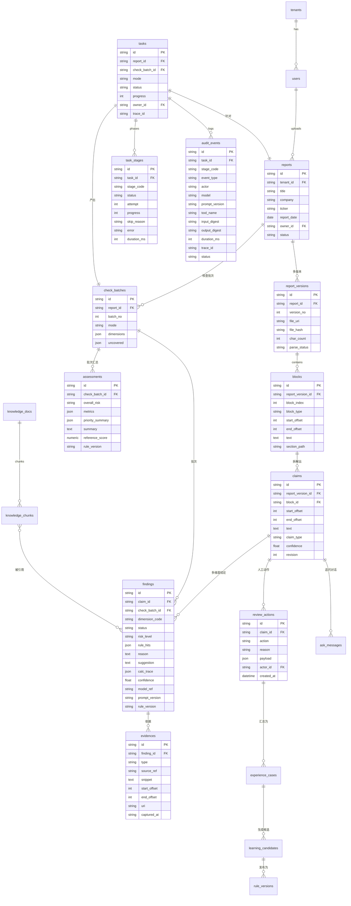

# 05 · 数据模型与接口契约

> 这是前后端唯一的"共同语言"。前端类型由本文件的接口定义生成，后端实现按本文件对齐。
> 上游约束：D2（偏移定位）、D4（三态结论）、D11（三套版本）。

---

## 0. 通用约定

| 约定 | 规定 |
| --- | --- |
| 主键 | 统一 `id`，UUID v7 字符串（时间有序，便于分页） |
| 时间 | 一律 UTC，`timestamptz`；接口返回 ISO 8601 带时区 |
| 表名/字段 | 小写蛇形，表名用复数（`reports`、`findings`） |
| 必备字段 | 每张业务表都有 `tenant_id`、`created_at`、`updated_at`、`created_by` |
| 删除 | 软删 `deleted_at`；审计与结论（`audit_events`、`findings`、`review_actions`）**不可删** |
| 枚举 | 数据库存字符串（可读、可 grep），取值由本文 §3 字典锁定 |
| 金额/比率 | 用 `numeric` 存（不用 float），接口返回字符串以免精度丢失 |
| 大字段 | 全文与证据快照存对象存储，库里只存路径 + 哈希 |

---

## 1. 实体关系（ER）



---

## 2. 核心表字段说明

### 2.1 研报侧

**`reports`（研报）**

| 字段 | 类型 | 说明 |
| --- | --- | --- |
| `id` | uuid | — |
| `title` | text | 报告名（默认取文件名，可改） |
| `company` / `ticker` | text | 公司 / 标的代码（**核查时必须选，外部取数以它为准**） |
| `report_date` | date | 核查基准日：外部数据一律以此日为准（防止用未来数据） |
| `owner_id` | uuid | 上传人 |
| `status` | text | `draft` / `checking` / `checked` / `archived` |
| `latest_version_no` | int | 便于列表展示 |

**`report_versions`（版本）**

| 字段 | 说明 |
| --- | --- |
| `version_no` | 从 1 递增；重新上传同报告产生新版本 |
| `file_uri` / `file_hash` | 对象存储路径 / SHA-256（去重与审计） |
| `char_count` | 解析后总字符数（偏移量的上界） |
| `parse_status` / `parse_error` | 解析状态与失败原因 |

### 2.2 解析与拆解侧

**`blocks`（原文块）**

| 字段 | 说明 |
| --- | --- |
| `block_index` | 文档内顺序（渲染顺序） |
| `block_type` | `heading` / `paragraph` / `table_cell` / `caption` / `bullet` |
| `start_offset` / `end_offset` | **在 `report_version` 全文纯文本中的字符区间**（D2 的锚点） |
| `text` | 块文本（与区间内容一致，冗余存储便于渲染） |
| `section_path` | 章节路径，如 `二、盈利预测 > 2.1 营收拆分` |

**`claims`（可核查的主张）**

| 字段 | 说明 |
| --- | --- |
| `block_id` + `start_offset` / `end_offset` | 相对该 block 的**局部偏移**（渲染用） |
| `text` | 主张原文 |
| `claim_type` | 见 §3 字典：`calc` `fact` `valuation` `forecast` `norm` `judgement` |
| `confidence` | 拆解置信度；低于阈值（0.6）的标"待人工确认" |
| `revision` | 人工修改后 +1，用于并发控制（复核请求带 `If-Match`） |
| 唯一键 | `(report_version_id, block_id, start_offset, end_offset, claim_type)` → 幂等 upsert |

### 2.3 结论侧（系统的核心资产）

**`findings`（一条核查结论）**

| 字段 | 说明 |
| --- | --- |
| `dimension_code` | 哪个维度给的结论 |
| `status` | `pass`（查了没问题）/ `risk`（有问题）/ `uncovered`（没查）/ `error`（查失败） |
| `risk_level` | `high` / `medium` / `low`；`status != risk` 时为 null |
| `rule_hits` | `["R-CALC-01"]`：命中规则编号（定级依据，可追溯） |
| `reason` | 判断理由（一段人话，直接展示给用户） |
| `suggestion` | 修改建议（可直接替换的文本） |
| `calc_trace` | 计算过程 JSON（见 §4.1），仅计算类有 |
| `confidence` | 模型自评置信度（**仅作参考，不参与定级**） |
| `model_ref` / `prompt_version` / `rule_version` | 可复现三要素（D11） |
| 唯一键 | `(claim_id, dimension_code, check_batch_id)` |

**`evidences`（证据）**

| 字段 | 说明 |
| --- | --- |
| `type` | `kb_chunk`（知识库）/ `data_source`（外部数据）/ `in_text`（文内互证）/ `calc`（计算过程）/ `external_report`（外部研报） |
| `source_ref` | 具体来源 ID：`knowledge_chunks.id` / 数据接口名 + 参数 / `blocks.id` |
| `snippet` | 证据原文片段（展示用） |
| `start_offset` / `end_offset` | 若为文内互证，带区间可跳转 |
| `uri` | 可点开的来源链接（数据源页面 / 对象存储文件） |
| `captured_at` | 取数时间（外部数据的时效说明） |

**规则：`status = risk` 时至少有 1 条 `evidences`**，否则该 Finding 降级为 `uncovered`（防幻觉）。

**`review_actions`（人工动作，追加不可改）**

| 字段 | 说明 |
| --- | --- |
| `action` | `accept`（接受修改）/ `reject`（驳回 AI）/ `verify`（标记已核实）/ `add_evidence`（补充证据）/ `manual_edit`（人工修改） |
| `reason` | 驳回时**必填**；其他可选 |
| `payload` | 动作数据：`{edited_text}` / `{evidence:{...}}` / `{accepted_suggestion}` |
| `actor_id` / `created_at` | 谁、何时 |

**`check_batches`（核查批次）**：一次核查一个批次。重复核查产生新批次，**旧批次的 Finding 与 Assessment 完整保留**，用于"修改历史对比"。

### 2.4 三态结论怎么算（D4 的核心，前端展示口径）

不额外存字段，**查询时按规则算**（避免冗余字段不一致）：

| 名称 | 计算规则 |
| --- | --- |
| **AI 结论** | 该 Claim 最近一条 `finding`（按批次倒序） |
| **人工结论** | 该 Claim 最近一条 `review_action`；无则 null |
| **生效结论** | `manual_edit` → 人工文本；`accept` → AI 的 `suggestion`；`reject` → 视原文为无此问题；`verify` → 原文通过；**无人工动作 → "待复核"（不算通过）** |
| **复核状态** | 待复核 / 已接受 / 已驳回 / 已核实 / 已人工修改（由最近一条动作决定） |
| **复核进度** | `已复核 Claim 数 / 待复核 Claim 总数`（**未覆盖的 Claim 也计入待复核**，不能被进度掩盖） |

### 2.5 任务与审计侧

**`tasks`**：`report_id`、`check_batch_id`、`mode`（`quick`/`deep`）、`status`（`pending`/`running`/`completed`/`partial_failed`/`failed`/`cancelled`）、`progress`（0–100 加权）、`owner_id`、`trace_id`。

**`task_stages`**：`stage_code`、`status`、`attempt`、`progress`、`stat`（如 `{"claims_total":412,"done":320}`）、`skip_reason`、`error`、`started_at`/`finished_at`、`duration_ms`。唯一键 `(task_id, stage_code, attempt)`。

**`audit_events`**：见 §2 的 ER 与 `03_后端架构.md` §8.1。索引：`(task_id, created_at)`、`(trace_id)`、`(claim_id)`。

### 2.6 知识与学习侧

| 表 | 关键字段 |
| --- | --- |
| `knowledge_docs` | `type`（`norm`/`valuation`/`forbidden_expr`/`metric_def`/`case`/`external_report`）、`title`、`version`、`enabled`、`effective_from`、`scope`（适用核查维度）、`file_uri` |
| `knowledge_chunks` | `doc_id`、`chunk_index`、`text`、`embedding`（vector）、`meta`（章节、页码）、`tsv`（全文检索列） |
| `experience_cases` | `claim_id`、`ai_finding_id`、`review_action_id`、`case_type`（AI 错 / AI 对 / 人工补充）、`labels[]`、`summary` |
| `learning_candidates` | `type`（`rule`/`prompt`/`case`）、`content`、`source_case_ids[]`、`impact_dimensions[]`、`state`（`pending`/`approved`/`rejected`）、`reviewer_id`、`review_note` |
| `rule_versions` | `kind`（`risk_rule`/`prompt`/`threshold`）、`key`、`version`、`content`、`state`（`active`/`archived`/`canary`）、`published_by`、`published_at` |

**发布语义**：`learning_candidates` 被 approve 后**生成新的 `rule_versions` 记录并置为 active**，旧版本自动 archived；同一个 key 同时只有一个 active（灰度时允许多个 canary）。

---

## 3. 枚举字典（唯一来源，前后端共用）

| 字典 | 取值 | 说明 |
| --- | --- | --- |
| `claim_type` | `calc` 计算 / `fact` 事实 / `valuation` 估值 / `forecast` 预测 / `norm` 规范 / `judgement` 观点 | 拆解阶段的分类，决定派给哪些维度 |
| `dimension_code` | `calc` `fact` `norm` `valuation` `consistency` `quality_logic` `quality_data` `quality_risk` `quality_cross` | 与 `03` 的注册表一致 |
| `finding_status` | `pass` `risk` `uncovered` `error` | 四种，缺一不可（D12） |
| `risk_level` | `high` `medium` `low` | 仅 `status=risk` 时存在 |
| `task_status` | `pending` `running` `completed` `partial_failed` `failed` `cancelled` | — |
| `stage_status` | `pending` `running` `done` `failed` `skipped` | skipped 必须带原因 |
| `review_action` | `accept` `reject` `verify` `add_evidence` `manual_edit` | — |
| `review_state` | `pending` `accepted` `rejected` `verified` `edited` | 由动作推导 |
| `evidence_type` | `kb_chunk` `data_source` `in_text` `calc` `external_report` | — |
| `knowledge_type` | `norm` `valuation` `forbidden_expr` `metric_def` `case` `external_report` | 与 `required_inputs` 的取值对应 |
| `event_type` | `stage_start` `stage_end` `llm_call` `tool_call` `review_action` `rule_publish` | 审计事件类型 |
| `mode` | `quick` `deep` | 快速核查 / 深度评估 |

---

## 4. 关键 JSON 结构

### 4.1 `calc_trace`（计算过程，前端"核算过程"直接渲染）

```json
{
  "expression": "(12.3 - 10.1) / 10.1",
  "unit": "亿元",
  "steps": [
    { "label": "2026Q2 营收", "value": "12.3", "source": "原文第 3 段" },
    { "label": "2025Q2 营收", "value": "10.1", "source": "原文第 3 段" },
    { "label": "同比增速", "value": "0.2178", "note": "保留四位小数" }
  ],
  "computed": "21.78%",
  "claimed": "25%",
  "deviation": "-3.22pct",
  "tolerance": "1%",
  "conclusion": "mismatch"
}
```

### 4.2 `assessment.metrics`（报告级指标，全部可算、可复现）

```json
{
  "claims_total": 412,
  "covered": 380,
  "uncovered": 32,
  "coverage_rate": 0.9223,
  "risk_counts": { "high": 6, "medium": 11, "low": 24, "pass": 339 },
  "by_dimension": [
    { "code": "calc", "problems": 9, "checked": 120, "coverage": 1.0 },
    { "code": "norm", "problems": 4, "checked": 412, "coverage": 1.0 },
    { "code": "fact", "problems": 8, "checked": 210, "coverage": 0.84,
      "uncovered_reason": "财务数据源不可用（超时 3 次）" }
  ],
  "qualitative_without_data_rate": 0.31,
  "risk_disclosure_covered": true,
  "cross_view_consistent": 7,
  "cross_view_conflicts": 2
}
```

### 4.3 单条 Finding 的完整响应（审阅页右侧卡片的数据）

```json
{
  "id": "f_01H...",
  "claim": {
    "id": "c_01H...",
    "text": "2026Q2 公司实现营业收入 12.3 亿元，同比增长 25%",
    "block_id": "b_88",
    "block_index": 88,
    "start_offset": 12,
    "end_offset": 45,
    "claim_type": "calc",
    "section_path": "二、盈利预测 > 2.1 营收拆分",
    "revision": 2
  },
  "dimension_code": "calc",
  "dimension_name": "计算核查",
  "status": "risk",
  "risk_level": "high",
  "rule_hits": [{ "code": "R-CALC-01", "desc": "复算结果与原文数字不一致（相对误差 > 1%）" }],
  "reason": "根据原文给出的 2025Q2 营收 10.1 亿元复算，同比增速为 21.78%，与文中 25% 相差 3.22 个百分点。",
  "suggestion": "建议将同比增速修改为 21.78%（或补充说明 25% 的计算口径）",
  "calc_trace": { "...": "见 4.1" },
  "evidences": [
    { "id": "e_01", "type": "in_text", "snippet": "2025Q2 实现营业收入 10.1 亿元",
      "start_offset": 620, "end_offset": 640, "uri": null },
    { "id": "e_02", "type": "data_source", "snippet": "2026Q2 营业收入 1,230,000,000 元",
      "uri": "internal://financial/600XXX/2026Q2", "captured_at": "2026-09-24T02:11:03Z" }
  ],
  "review": {
    "state": "pending",
    "ai_conclusion": "高风险：计算错误",
    "human_conclusion": null,
    "effective_conclusion": "待复核",
    "actions": []
  },
  "trace": { "task_id": "t_01H...", "trace_id": "0af7...", "model_ref": "deep-fast-v1",
             "prompt_version": "calc_check.v3", "rule_version": "r2026.09" }
}
```

---

## 5. 接口清单

统一前缀 `/api/v1`。分页统一 `?page=1&page_size=20`，返回 `{ items, total, page, page_size }`。

### 5.1 认证与维度

| 方法 | 路径 | 说明 |
| --- | --- | --- |
| POST | `/auth/register` | 注册（公司 + 角色） |
| POST | `/auth/login` | 登录，返回 access/refresh |
| POST | `/auth/refresh` | 刷新令牌 |
| GET | `/me` | 当前用户与权限 |
| GET | `/dimensions` | **维度注册表**（含 `required_inputs`、`enabled_in_modes`），驱动核查设置页 |

### 5.2 研报

| 方法 | 路径 | 说明 |
| --- | --- | --- |
| POST | `/reports` | 上传研报（multipart：file + company + ticker + report_date + title），返回 report 与 version |
| GET | `/reports` | 报告列表（筛选：company / status / date / owner） |
| GET | `/reports/{id}` | 报告详情（含版本、最新批次、统计计数） |
| POST | `/reports/{id}/versions` | 上传新版本（同一研报的修订稿） |
| GET | `/reports/{id}/blocks` | 原文块（分页或按章节），渲染左栏 |
| GET | `/reports/{id}/versions/{v}/diff` | 版本差异（改了哪些块、哪些结论消失/新增） |
| GET | `/reports/{id}/export` | 导出评估报告（docx/pdf） |

### 5.3 任务与进度

| 方法 | 路径 | 说明 |
| --- | --- | --- |
| POST | `/tasks` | 创建核查任务 `{report_id, mode, dimensions[], options}`；缺资料时返回 `409 + missing_inputs` |
| GET | `/tasks` | 任务列表（工作台/任务中心共用） |
| GET | `/tasks/{id}` | 任务详情 + 阶段列表 + 计数 |
| GET | `/tasks/{id}/events` | **SSE 进度流** |
| POST | `/tasks/{id}/cancel` | 终止任务（保留已完成产物） |
| POST | `/tasks/{id}/stages/{code}/retry` | 重试单个阶段 |
| POST | `/reports/{id}/recheck` | 重新核查（新建批次） |

### 5.4 结论与审阅

| 方法 | 路径 | 说明 |
| --- | --- | --- |
| GET | `/reports/{id}/claims` | Claim 列表（筛选：risk / status / dimension / type / section）；审阅页右侧数据源 |
| GET | `/claims/{id}/findings` | 该 Claim 的全部维度结论 |
| GET | `/claims/{id}` | 单条详情（含三态结论） |
| POST | `/claims/{id}/reviews` | 提交人工动作 `{action, reason?, payload?}`；带 `If-Match: <revision>`，冲突返回 409 |
| GET | `/claims/{id}/reviews` | 复核历史（时间倒序，含 AI 原结论） |
| POST | `/claims/{id}/ask` | 单条追问（**SSE 流式返回**） |
| GET | `/claims/{id}/ask` | 历史追问记录 |

### 5.5 评估与复核列表

| 方法 | 路径 | 说明 |
| --- | --- | --- |
| GET | `/reports/{id}/assessment` | 报告级评估（`?batch=` 指定批次） |
| GET | `/reviews/summary` | 工作台用：待复核 / 高风险 / 近 7 天计数 |
| GET | `/reviews/reports` | 复核列表第一层（报告级，含进度与计数） |
| GET | `/reviews/{reportId}/queue` | 复核列表第二层（主张级队列） |
| POST | `/reviews/batch` | 批量动作（仅允许 `verify`；批量 `reject` 必须逐条理由） |

### 5.6 知识库 / 经验学习 / 审计 / 帮助

| 方法 | 路径 | 说明 |
| --- | --- | --- |
| GET / POST / PATCH / DELETE | `/knowledge/docs` | 知识库文档 CRUD（软删） |
| POST | `/knowledge/docs/{id}/enable` | 启用 / 停用（影响后续任务，不影响历史结论） |
| GET | `/knowledge/chunks` | 分片检索与查看 |
| GET | `/learning/cases` | 经验案例列表（来源：人工裁决） |
| POST | `/learning/candidates` | 生成候选（也可由定时任务生成） |
| POST | `/learning/candidates/{id}/review` | 管理员审核（approve / reject + 理由） |
| GET | `/learning/versions` | 已发布版本 + 回滚入口 |
| POST | `/learning/versions/{id}/rollback` | 回滚到指定版本 |
| GET | `/audit/events` | 审计日志（筛选：task / stage / event_type / model / tool / 时间） |
| GET | `/audit/trace/{traceId}` | 按 trace_id 拉全链路 |
| GET | `/help/articles` | 帮助文档目录与内容 |
| GET / POST / PATCH | `/admin/users` | 用户与角色（P2） |

---

## 6. SSE 事件契约（`GET /tasks/{id}/events`）

```
event: stage
data: {"stage_code":"claim_classify","status":"running","progress":78,"message":"320/412","ts":"..."}

event: counters
data: {"claims_total":412,"findings_high":6,"findings_medium":11,"findings_low":24,"uncovered":32}

event: task
data: {"status":"partial_failed","message":"3 条 Claim 核查失败","progress":100}

event: error
data: {"stage_code":"check","message":"财务数据源不可用","retryable":true}

event: heartbeat
data: {"ts":"..."}
```

--- 

## 7. 错误码

| code | HTTP | 含义 | 前端处理 |
| --- | --- | --- | --- |
| `AUTH_TOKEN_EXPIRED` | 401 | 令牌过期 | 自动刷新一次，失败跳登录 |
| `AUTH_FORBIDDEN` | 403 | 无权限 | 显示无权限态 |
| `VALIDATION_ERROR` | 400 | 参数错误 | 字段级提示 |
| `REPORT_PARSE_FAILED` | 422 | 文档无法解析 | 提示改传可复制文本版本 |
| `TASK_MISSING_INPUTS` | 409 | 所选维度缺资料 | 返回 `missing_inputs[]`，弹上传引导 |
| `TASK_ALREADY_RUNNING` | 409 | 该报告已有运行中任务 | 跳转到进行中任务 |
| `STAGE_NOT_RETRYABLE` | 409 | 该阶段不可重试 | 提示原因 |
| `CLAIM_REVISION_CONFLICT` | 409 | 复核冲突（他人已改） | 刷新为最新并提示 |
| `REVIEW_REASON_REQUIRED` | 400 | 驳回未填理由 | 定位到理由输入框 |
| `EVIDENCE_REQUIRED` | 500 | 生成了无证据的高风险结论 | 内部缺陷，记日志告警 |
| `UPSTREAM_UNAVAILABLE` | 503 | 模型/数据源不可用 | 提示稍后重试，任务侧标未覆盖 |
| `RATE_LIMITED` | 429 | 超过并发/频率限制 | 提示排队中 |
| `INTERNAL_ERROR` | 500 | 未预期错误 | 显示错误码 + traceId |

**统一错误体**：

```json
{ "code": "TASK_MISSING_INPUTS",
  "message": "观点交叉验证需要外部研报库，请先上传",
  "details": { "missing_inputs": ["external_reports"] },
  "trace_id": "0af7c1..." }
```

---

## 8. 分页、过滤与排序约定

| 参数 | 约定 |
| --- | --- |
| `page` / `page_size` | 默认 `1` / `20`，最大 `200` |
| `sort` | `field:asc|desc`，白名单字段（后端校验，拒绝任意字段排序） |
| 时间过滤 | `date_from` / `date_to`（ISO 日期） |
| 风险过滤 | `risk=high,medium`（逗号分隔，默认返回全部**含 uncovered**） |
| 检索 | `q=` 全文（仅限已建索引字段） |
| 大数据集 | 审计日志与 Claim 列表必须分页；**禁止无分页拉全量** |

**排序默认值（有业务含义，写死在后端，不由前端随便改）**：
- 复核队列：`risk_level desc, has_evidence desc, created_at asc`
- 报告级复核列表：`待复核且高风险优先 → 最近更新倒序`
- Claim 列表（审阅页）：按 `block_index` 升序（与原文顺序一致）——**审阅页必须按原文顺序，不能按风险排序**（否则左右栏无法联动）。

---

## 9. 契约的维护方式

1. 后端用 Pydantic 定义请求/响应模型，FastAPI 自动产出 OpenAPI。
2. CI 里跑 `openapi-typescript` 生成前端类型到 `src/api/generated/`；契约变了 CI 会报警。
3. 本文档中的字段若有变更，**必须同时改本文与代码**，并在 PR 描述里说明影响面（前端 / 迁移 / 历史数据）。
4. 契约测试：对每个接口至少一个"响应结构符合本文 §4 示例"的测试用例，防止字段悄悄被删。
